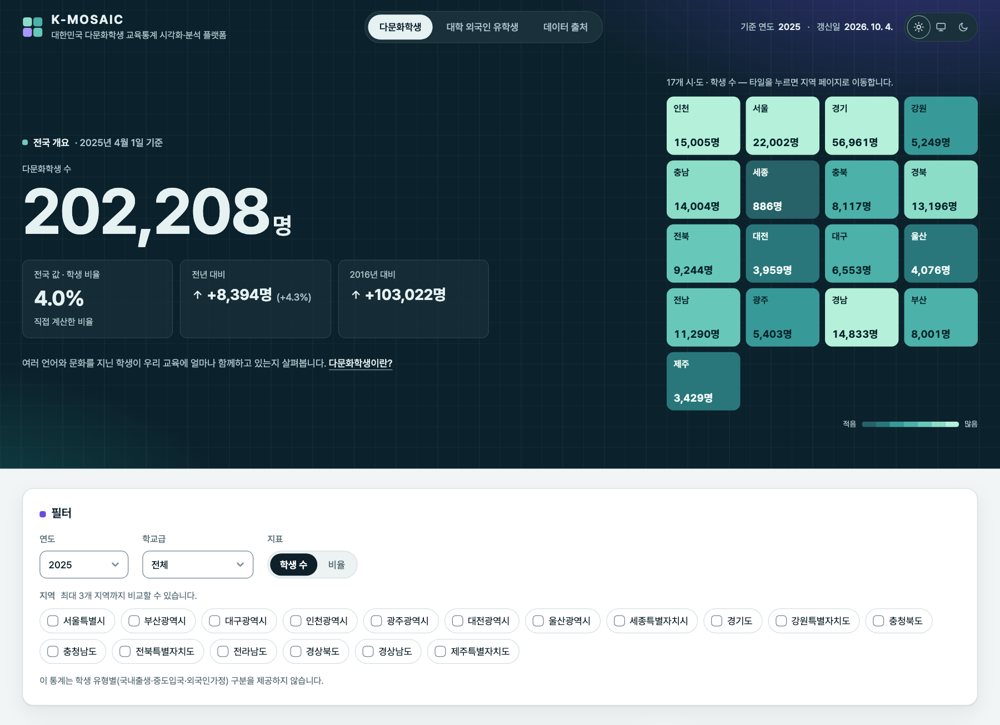
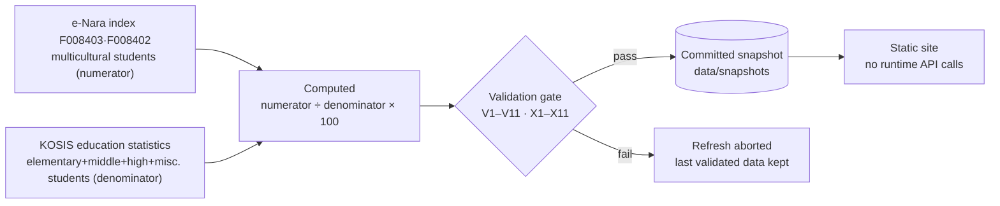

<div align="center">

# K-MOSAIC

**Korea Multicultural Student Data Explorer**<br>
대한민국 다문화학생 교육통계 탐색기

[한국어](README.md) · English

[](https://github.com/taehyeonglim/k-mosaic/actions/workflows/deploy.yml)
[](data/snapshots)
[](e2e/axe.spec.ts)
[](LICENSE)

### [▶ Live demo — taehyeonglim.github.io/k-mosaic](https://taehyeonglim.github.io/k-mosaic/)

</div>

<picture>
  <source media="(prefers-color-scheme: dark)" srcset="docs/images/dashboard-hero-dark.png">
  
</picture>

An interactive explorer for the number and share of **multicultural students** (다문화학생) in Korea's 17 provinces — as a map, rankings and time series.
Every number on screen can be traced back to its **source, statistical table ID, formula and limitations**. The interface is in Korean.

## At a glance

| Indicator (as of 1 April 2025) | Value |
|---|---|
| Multicultural students, nationwide | **202,208** |
| Share of all students | **4.0%** (computed) |
| Coverage | provinces 2020–2025 · nationwide by school level **2016–2025** · elementary, middle, high and miscellaneous schools |
| Separate page | [International students in higher education](https://taehyeonglim.github.io/k-mosaic/foreign-students/) — a different population; do not compare directly |

"Multicultural students" is an official category of the Ministry of Education and KEDI's *Statistical Yearbook of Education* (교육기본통계). It covers children of international marriages (born in Korea or migrated mid-childhood) and children of foreign families.

## Why you can trust these numbers



- **The KOSIS Open API has no multicultural-student statistics.** After confirming this through six independent routes, the numerator comes from the e-Nara index and the share is computed ([data audit](docs/data-audit.md), in Korean).
- **The denominator was reverse-engineered.** Only elementary + middle + high + miscellaneous schools reproduces 100% of the published shares within ±0.05 pp (provinces 2020–2025 and nationwide 2016–2025); adding special schools drops it to 81.3%. The 2022 national count (168,645) matches KEDI's published figure exactly.
- **Published shares are not displayed as-is.** The 2025 published shares are rounded to integers (7.0, 6.0, …), so the site shows computed values and keeps the published ones for cross-checking.
- **Missing is not zero.** Missing values stay `null` and are drawn with a hatch pattern on the map.
- **Nothing is published unless it validates.** CI re-runs the validation rules on every PR and blocks any loss of year coverage against the base branch. New-year releases are watched automatically and open an issue ([operations guide](docs/operations.md)).

## Features

- **National overview & tile mosaic** — the landing view shows the national figures and a tile per province; tiles link to province pages, and the headline numbers are in the static HTML so they read without JavaScript
- **Choropleth map** — count/share toggle, keyboard navigation, scale fixed across years, hatched missing regions, table alternative
- **Four rankings** — count, share, absolute change, growth rate; ties share a rank, with a note that rankings do not measure educational quality
- **Time series & comparison** — ten-year national trend (2016–) plus up to three regions (2020–), gaps not interpolated
- **Province pages** — a static page per province, e.g. [`/regions/11/`](https://taehyeonglim.github.io/k-mosaic/regions/11/), with summary, school-level breakdown, trend and yearly table (for sharing and search)
- **Shareable views** — year, school level, metric and region filters live in the URL
- **Sources & methodology** — table IDs, publishers, formula and reference date reachable from every view
- **Downloads** — filtered CSV with provenance comments, full CSV/JSON, data dictionary
- **Accessibility** — automated WCAG 2.1 A/AA checks (axe), light/dark themes, 360 px mobile

<details>
<summary>Map & ranking · time series · international students page</summary>

<picture>
  <source media="(prefers-color-scheme: dark)" srcset="docs/images/dashboard-map-dark.png">
  
</picture>

<picture>
  <source media="(prefers-color-scheme: dark)" srcset="docs/images/dashboard-trend-dark.png">
  
</picture>

<picture>
  <source media="(prefers-color-scheme: dark)" srcset="docs/images/foreign-students-dark.png">
  
</picture>

</details>

### International students in higher education (`/foreign-students`)

> ⚠️ This is **a different student population** from the main page: multicultural students are in primary/secondary schools, international students are enrolled in higher education. Do not compare the two directly ([DL-008](docs/decision-log.md)).

| Series | 2025 | Source |
|---|---|---|
| International students (degree programmes), by province | 202,852 · 7.0% of enrolment | KOSIS `DT_1963003_010_S` (2022–) |
| National long-run — degree + language training / degree only | 253,434 / 179,190 | e-Nara index `153401` (2018–) |

The two sources count differently, so values differ for the same year. The source publishes identical 2022 and 2023 provincial values; the site flags this as "needs verification" ([DL-009](docs/decision-log.md)).

## Reading the data responsibly

- A high share does not signal a problem or risk — which is why no warning colours are used.
- Regional rankings do not measure educational quality.
- A region without data is **"no data"**, never `0`.
- **The "national value" is not the mean of 17 provincial shares**; it is computed from national totals.

| Known limitation | Status |
|---|---|
| By student type (born in Korea / migrated / foreign family) | ❌ not published by the source ([DL-001](docs/decision-log.md)) |
| District (시·군·구) level | ❌ provinces are the finest level |
| Kindergartens, special schools | ❌ outside this statistic's denominator ([DL-004](docs/decision-log.md)) |
| Provinces before 2020 | ❌ provincial data starts in 2020 (nationwide by school level from 2016) |
| Provisional vs. final figures | ⚠️ not distinguished by the source — shown as "unconfirmed" |

## Quick start

```bash
pnpm install
pnpm dev          # http://localhost:3000
```

Node.js ≥ 20 and pnpm 11. The web app reads committed snapshots only, so **no API key is needed to develop or build.** The key is used once a year to refresh the data.

| I want to… | Read |
|---|---|
| set up, test, follow the code rules | [CONTRIBUTING.md](CONTRIBUTING.md) |
| refresh data, deploy, handle secrets | [docs/operations.md](docs/operations.md) |
| know where the data comes from and what is missing | [docs/data-audit.md](docs/data-audit.md) |
| see the schema and validation rules | [docs/data-dictionary-draft.md](docs/data-dictionary-draft.md) |
| understand design decisions | [docs/decision-log.md](docs/decision-log.md) · [ADRs](docs/adr/) |

Project documentation is written in Korean.

## Tech stack

Next.js 16 App Router (static export) · TypeScript strict · Zod (single source of truth for snapshot schemas) · d3-geo + SVG map ([ADR-002](docs/adr/002-map-library.md)) · Recharts ([ADR-003](docs/adr/003-chart-library.md)) · Tailwind CSS v4 · Vitest · Playwright + axe · GitHub Pages

## Citation

Use the repository's **Cite this repository** button ([CITATION.cff](CITATION.cff)), and credit the original source as well.

> Lim, T. (2026). *K-MOSAIC: Korea Multicultural Student Data Explorer* [Software and dataset]. https://github.com/taehyeonglim/k-mosaic — Source data: Ministry of Education & KEDI, *Statistical Yearbook of Education*.

## License and data sources

**Code**: [MIT License](LICENSE) © 2026 Taehyeong Lim

**Data** follows each source's terms, independent of the code license.

| Role | Source | Table |
|---|---|---|
| Multicultural students | [e-Nara index F0084](https://www.index.go.kr/unify/idx-info.do?idxCd=F0084) | `F008403` (provinces) · `F008402` (nationwide by level) · `F008401` (published shares, cross-check) |
| All students | [KOSIS](https://kosis.kr) education statistics | `DT_1963003_002·003·004·009` |
| International students | KOSIS higher-education overview · [e-Nara index 1534](https://www.index.go.kr/unify/idx-info.do?idxCd=1534) | `DT_1963003_010_S` · `153401` |
| Original statistics | Ministry of Education & KEDI, *Statistical Yearbook of Education* | |
| Administrative boundaries | Statistics Korea SGIS — KOGL Type 1 (processed by [vuski/admdongkor](https://github.com/vuski/admdongkor), CC BY 4.0) | [geo-source.md](docs/geo-source.md) |
| Typeface | [Pretendard](https://github.com/orioncactus/pretendard) — SIL Open Font License 1.1 (self-hosted) | |
