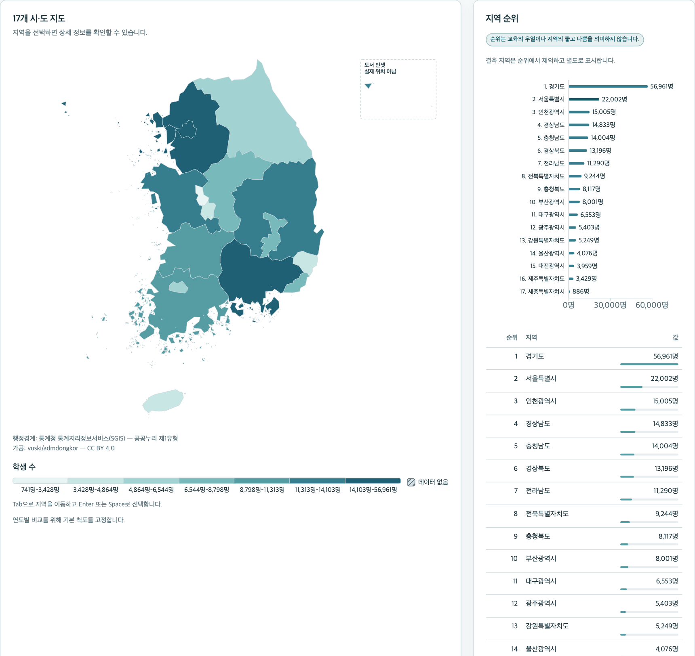
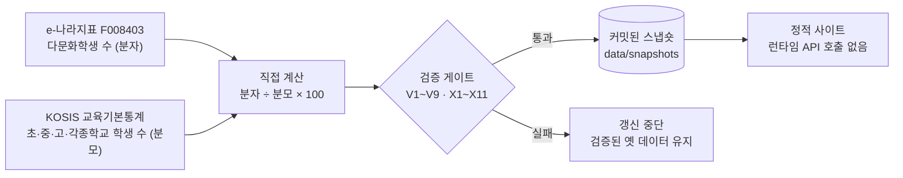
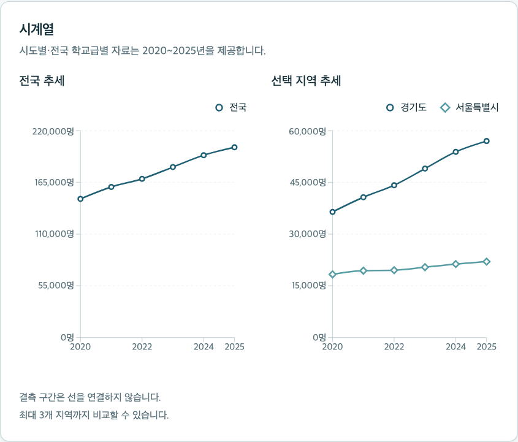
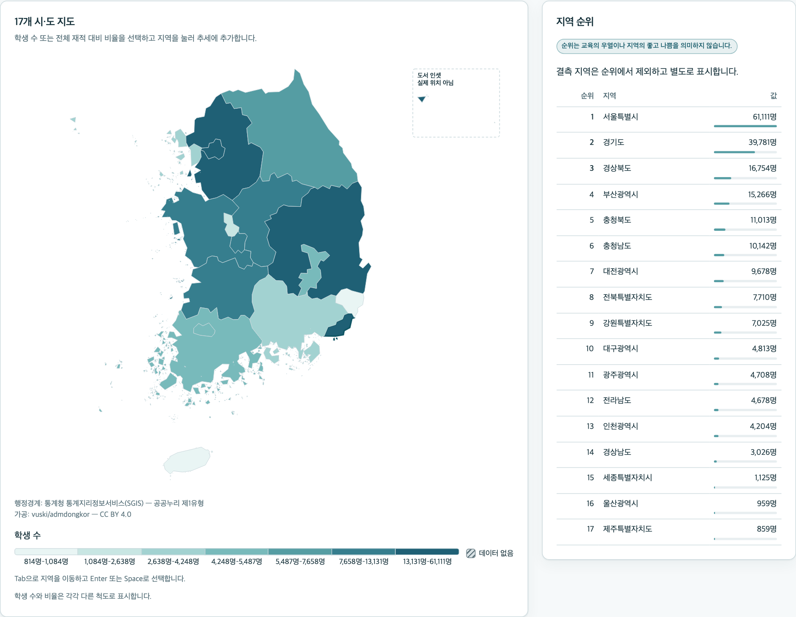

<div align="center">

# K-MOSAIC

**대한민국 다문화학생 교육통계 탐색기**<br>
Korea Multicultural Student Data Explorer

한국어 · [English](README.en.md)

[](https://github.com/taehyeonglim/k-mosaic/actions/workflows/deploy.yml)
[](data/snapshots)
[](e2e/axe.spec.ts)
[](LICENSE)

### [▶ 라이브 데모 — taehyeonglim.github.io/k-mosaic](https://taehyeonglim.github.io/k-mosaic/)

</div>

<picture>
  <source media="(prefers-color-scheme: dark)" srcset="docs/images/dashboard-map-dark.png">
  
</picture>

17개 시·도의 다문화학생 수와 비율을 **지도·순위·시계열**로 탐색합니다.
통계를 보여주는 데 그치지 않고, 화면의 모든 숫자에서 **출처·통계표 ID·계산식·한계**까지 거슬러 올라갈 수 있게 만들었습니다.

## 한눈에 보기

| 지표 (2025년 4월 1일 기준) | 값 |
|---|---|
| 전국 다문화학생 | **202,208명** |
| 전체 학생 대비 비율 | **4.0%** (직접 계산) |
| 수록 범위 | 2020~2025년 · 전국 + 17개 시·도 · 초·중·고·각종학교 |
| 별도 페이지 | [대학 외국인 유학생](https://taehyeonglim.github.io/k-mosaic/foreign-students/) — 다른 집단이므로 직접 비교 금지 |

## 왜 이 숫자를 믿을 수 있나



- **KOSIS OpenAPI에는 다문화학생 통계가 없습니다.** 6개 독립 경로로 확인한 뒤, 분자는 e-나라지표에서 가져오고 비율은 직접 계산합니다 ([데이터 감사](docs/data-audit.md)).
- **모수는 역검증으로 확정했습니다.** 초·중·고·각종학교 합계만 공표 비율과 ±0.05%p 이내로 100% 일치합니다. 특수학교를 넣으면 81.3%로 떨어집니다. 2022년 전국 168,645명은 한국교육개발원 공표치와 정확히 같습니다.
- **공표 비율을 그대로 쓰지 않습니다.** 2025년 공표 비율은 정수로 반올림돼 있어(전남 7.0, 충남 6.0…) 화면에는 계산값을 쓰고 공표치는 대조용으로 보존합니다.
- **결측은 0이 아닙니다.** `null`로 보존하고 지도에서는 사선 패턴으로 표시합니다.
- **검증에 실패하면 공개하지 않습니다.** PR마다 CI가 검증 규칙과 base 브랜치 대비 연도 커버리지 축소를 다시 확인합니다. 새 연도 공표는 자동으로 감시해 이슈를 엽니다 ([운영 가이드](docs/operations.md)).

## 주요 기능

- **단계구분도** — 학생 수·비율 전환, 키보드 조작, 연도 간 고정 척도, 결측 사선 패턴, 표 대체 표현
- **지역 순위 4종** — 학생 수·비율·절대 증가·증가율. 동률은 공동 순위, 순위가 교육의 우열이 아님을 함께 표시
- **시계열·지역 비교** — 전국 추세와 최대 3개 지역 비교, 결측 구간 단절
- **공유 가능한 화면** — 연도·학교급·지표·지역 필터가 URL에 반영
- **출처와 방법론** — 모든 화면에서 통계표 ID, 작성기관, 계산식, 기준일로 이동
- **다운로드** — 필터 결과 CSV(출처 주석 포함), 전체 CSV/JSON, 데이터 사전
- **접근성** — WCAG 2.1 A/AA 자동 검사(axe), 라이트·다크 테마, 모바일 360px

<details>
<summary>시계열 · 대학 외국인 유학생 페이지 화면</summary>

<picture>
  <source media="(prefers-color-scheme: dark)" srcset="docs/images/dashboard-trend-dark.png">
  
</picture>

<picture>
  <source media="(prefers-color-scheme: dark)" srcset="docs/images/foreign-students-dark.png">
  
</picture>

</details>

### 대학 외국인 유학생 (`/foreign-students`)

> ⚠️ 메인 화면의 다문화학생과 **서로 다른 학생 집단**입니다. 다문화학생은 초·중등(각종학교 포함), 외국인 유학생은 고등교육기관 재적 학생입니다. 두 수치를 직접 비교하지 마세요 ([DL-008](docs/decision-log.md)).

| 계열 | 2025년 | 출처 |
|---|---|---|
| 시도별 외국인 학생수(학위과정) | 202,852명 · 재적 대비 7.0% | KOSIS `DT_1963003_010_S` (2022~) |
| 전국 장기 추세 — 학위+연수 / 학위 | 253,434명 / 179,190명 | e-나라지표 `153401` (2018~) |

두 출처는 집계 범위가 달라 같은 연도라도 값이 다릅니다. 출처에서 2023년 시도별 값이 2022년과 같게 제공되며, 화면에 "자료 확인 필요"로 표시합니다 ([DL-009](docs/decision-log.md)).

## 해석상 유의사항

"다문화학생"은 교육부·한국교육개발원 「교육기본통계」의 공식 분류로, 국제결혼가정 자녀(국내출생·중도입국)와 외국인가정 자녀를 포함합니다. 행정 통계를 위한 범주이며 학생 개개인의 정체성·언어능력·문화적 배경을 설명하지 않습니다.

- 비율이 높다는 것이 문제나 위험을 뜻하지 않습니다 — 그래서 경고색을 쓰지 않습니다.
- 지역 간 순위는 교육의 우열을 의미하지 않습니다.
- 데이터가 없는 지역은 `0명`이 아니라 **데이터 없음**입니다.
- **"전국 값"은 17개 시·도 비율의 산술평균이 아니라** 전국 합계 기반 비율입니다.

| 알려진 한계 | 상태 |
|---|---|
| 학생 유형별(국내출생·중도입국·외국인가정) | ❌ 출처가 제공하지 않음 ([DL-001](docs/decision-log.md)) |
| 시·군·구 단위 | ❌ 시도가 최소 단위 |
| 유치원·특수학교 | ❌ 이 통계의 모수에 없음 ([DL-004](docs/decision-log.md)) |
| 2019년 이전 | ❌ 시도별 자료는 2020년부터 |
| 잠정치·확정치 구분 | ⚠️ 출처가 제공하지 않음 — 화면에 "미확인" |

## 빠른 시작

```bash
pnpm install
pnpm dev          # http://localhost:3000
```

Node.js 20 이상, pnpm 11. 웹 앱은 커밋된 스냅숏만 읽으므로 **개발·빌드에 API 키가 필요 없습니다.** 키는 연 1회 데이터 갱신에만 씁니다.

| 하고 싶은 일 | 문서 |
|---|---|
| 개발 환경·테스트·코드 규칙 | [CONTRIBUTING.md](CONTRIBUTING.md) |
| 데이터 갱신·배포·보안 | [docs/operations.md](docs/operations.md) |
| 데이터가 어디서 왔고 무엇이 없는지 | [docs/data-audit.md](docs/data-audit.md) |
| 스키마·검증 규칙 | [docs/data-dictionary-draft.md](docs/data-dictionary-draft.md) |
| 설계 결정의 이유 | [docs/decision-log.md](docs/decision-log.md) · [ADR](docs/adr/) |

<details>
<summary>전체 문서 목록</summary>

| 문서 | 내용 |
|---|---|
| [project-brief.md](docs/project-brief.md) | 프로젝트 개요·원칙 |
| [data-audit.md](docs/data-audit.md) | 데이터 가용성 감사 — 모든 조사 증거 |
| [product-requirements.md](docs/product-requirements.md) | 제품 요구사항·수용 기준 |
| [data-dictionary-draft.md](docs/data-dictionary-draft.md) | 스키마·매핑표·검증 규칙 |
| [architecture.md](docs/architecture.md) | 시스템 구조·보안 설계 |
| [operations.md](docs/operations.md) | 운영 — 데이터 갱신 런북·배포·보안 |
| [design-system.md](docs/design-system.md) | 색상·타이포·접근성 |
| [testing-strategy.md](docs/testing-strategy.md) | 위험 기반 테스트 전략 |
| [implementation-roadmap.md](docs/implementation-roadmap.md) | 워크스트림·의존관계 |
| [decision-log.md](docs/decision-log.md) | 설계 결정 변경 기록 (DL-001~009) |
| [qa-report.md](docs/qa-report.md) | E2E·접근성 검증 결과와 결함 조치 |
| [uiux-improvement-plan.md](docs/uiux-improvement-plan.md) | UI/UX 개선 계획과 수용 기준 |
| [geo-source.md](docs/geo-source.md) | 행정경계 출처·라이선스·가공 기록 |
| [ADR-001](docs/adr/001-data-ingestion-architecture.md) · [002](docs/adr/002-map-library.md) · [003](docs/adr/003-chart-library.md) | 아키텍처 결정 기록 |

</details>

## 기술 스택

Next.js 16 App Router(정적 내보내기) · TypeScript strict · Zod(스냅숏 스키마의 단일 진실 원천) · d3-geo + SVG 지도 ([ADR-002](docs/adr/002-map-library.md)) · Recharts ([ADR-003](docs/adr/003-chart-library.md)) · Tailwind CSS v4 · Vitest · Playwright + axe · GitHub Pages

## 인용

연구·보고서에 인용할 때는 저장소의 **Cite this repository** 버튼([CITATION.cff](CITATION.cff))을 쓰거나, 원자료 출처를 함께 밝혀 주세요.

> Lim, T. (2026). *K-MOSAIC: 대한민국 다문화학생 교육통계 탐색기* [소프트웨어·데이터셋]. https://github.com/taehyeonglim/k-mosaic — 원자료: 교육부·한국교육개발원 「교육기본통계」.

## 라이선스와 데이터 출처

**코드**: [MIT License](LICENSE) © 2026 Taehyeong Lim

**데이터**는 코드 라이선스와 별개로 각 출처의 조건을 따릅니다.

| 역할 | 출처 | 통계표 |
|---|---|---|
| 다문화학생 수 | [e-나라지표 F0084](https://www.index.go.kr/unify/idx-info.do?idxCd=F0084) | `F008403` |
| 전체 학생 수 | [KOSIS](https://kosis.kr) 교육기본통계 | `DT_1963003_002·003·004·009` |
| 대학 외국인 유학생 | KOSIS 고등교육기관 개황 · [e-나라지표 1534](https://www.index.go.kr/unify/idx-info.do?idxCd=1534) | `DT_1963003_010_S` · `153401` |
| 원자료 작성 | 교육부·한국교육개발원 「교육기본통계」 | |
| 행정경계 | 통계청 SGIS — 공공누리 제1유형 (가공: [vuski/admdongkor](https://github.com/vuski/admdongkor), CC BY 4.0) | [geo-source.md](docs/geo-source.md) |
